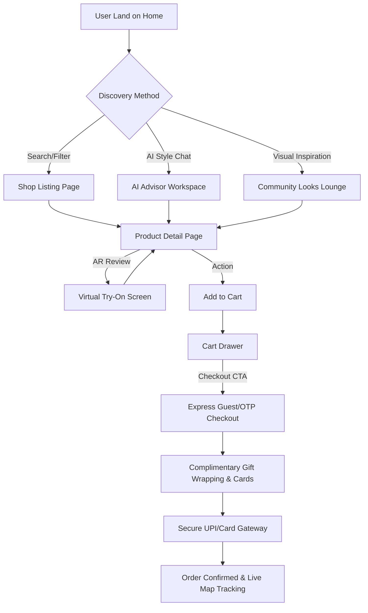

# 02 Information Architecture Specification: Lustra

## 1. Complete Sitemap Hierarchy
This sitemap structures the public-facing pages, interactive tools, transactional pathways, and internal customer portals:

* **Level 0: Home Page (/index.html)**
  * **Level 1: Shop Collections Portal (/shop/index.html)**
    * **Level 2: Rings Category Listing**
    * **Level 2: Earrings Category Listing**
    * **Level 2: Necklaces Category Listing**
    * **Level 2: Bracelets Category Listing**
    * **Level 2: Mangalsutra Collection**
    * **Level 2: Men's Fine Jewellery**
    * **Level 2: Product Detail Page (/shop/product.html?id=xxx)**
  * **Level 1: AI Design Studio Hub**
    * **Level 2: AI Style Advisor (/ai/advisor.html)**
    * **Level 2: AI Outfit Matcher (/ai/outfit-match.html)**
    * **Level 2: WebGL Virtual Try-On Portal (/try-on/index.html)**
  * **Level 1: Custom Jewellery Builder (/builder/index.html)**
  * **Level 1: Community & Edit Look Lounge (/community/index.html)**
  * **Level 1: Customer Accounts Portal (/profile/index.html)**
    * **Level 2: Active Orders / Tracking Hub (/orders/track.html)**
    * **Level 2: Saved Wishlist & Alerts (/wishlist/index.html)**
    * **Level 2: Customer Loyalty Progress (/profile/rewards.html)**
    * **Level 2: Addresses & Payment Configs**
  * **Level 1: Interactive Authentication (/auth/index.html)**
  * **Level 1: Support Center (/support/index.html)**
    * **Level 2: FAQs, Shipping guidelines, Return rules, Sustainability charters**

---

## 2. Header Navigation System
The header utilizes a sticky, transparent-to-frosted glass luxury navbar design mapping elements with precise interaction tags.

```
+-----------------------------------------------------------------------------------------+
|  [L U S T R A]   Shop   Collections   AI Studio   Custom Jewellery   Inspiration  [Search] [Wishlist] [Cart] [Profile] |
+-----------------------------------------------------------------------------------------+
```

### Nav Links Configuration:
1. **Shop (Triggers Shop Mega Menu):** Anchored category routes (Rings, Necklaces, etc.).
2. **Collections (Triggers Collections Mega Menu):** Focuses on seasonal collections (Wedding, Daily, Trending).
3. **AI Studio (Triggers AI Mega Menu):** Access point to advisor, matcher, and virtual try-ons.
4. **Custom Jewellery:** Redirects directly to the Custom Jewellery Configuration Workspace.
5. **Inspiration (Triggers Inspiration Mega Menu):** Interactive style guides and community looks.

---

## 3. Mega Menu Layouts
The Mega Menu is implemented as a full-width viewport overlay container (`.mega-menu`) that smoothly reveals on desktop hover with a custom CSS transition block, and expands via accordion panels on touch interfaces.

### Mega Menu A: Shop Category Explorer
* **Column 1: Fine Rings** (Solitaire, Engagement, Band Rings, Everyday Stackers).
* **Column 2: Earrings** (Classic Studs, Dangles, Hoops, Ear Cuffs).
* **Column 3: Necklaces & Pendants** (Choker Necklaces, Luxury Lariats, Solitaire Pendants, Mangalsutras).
* **Column 4: Bracelets & Bangles** (Tennis Bracelets, Rigid Cuff Bangles, Charm Chains).
* **Promo Showcase (Column 5):** "Meet the Solitaire Collection" - Beautiful high-fidelity image block featuring handcrafted premium solitaires, linking to the curated list page.

### Mega Menu B: Curated Collections
* **Column 1: Occasions** (Bridal & Wedding Elite, Festive Gold, Anniversary Milestones, Everyday Minimal).
* **Column 2: Metal Types** (18k Solid Yellow Gold, Platinum Elite, 14k Elegant Rose Gold).
* **Column 3: Trending Now** (Instagram Curated Favourites, Gender-Neutral Staples, New Arrivals).
* **Promo Showcase (Column 4):** "The Heritage Bridal Collection" - A high-luxury styled photographic block with collection link CTA.

### Mega Menu C: AI Discovery Studio
* **Column 1: AI Style Advisor** (Personalised style quiz, recommendations by persona).
* **Column 2: AI Outfit Matcher** (Upload outfit photo to receive curated metal pairings).
* **Column 3: Virtual Live-Camera Try-On** (Real-time face/ear/hand mapping tracker).
* **Promo Showcase (Column 4):** Labeled "Try the Virtual Studio" - Dynamic illustration/interaction prompt preview.

---

## 4. Footer Architecture
The footer is split into dynamic columns with clean typography scale (Caption / Label size) to preserve premium luxury minimalism:

* **Column 1: Collection Directories**
  * Rings, Earrings, Necklaces, Bracelets, Men’s Fine Collection, New Arrivals.
* **Column 2: Company Ethos**
  * Our Story, Artisanal Craftsmanship, Lifetime Exchange Policy, Carbon Neutrality, Careers.
* **Column 3: Help & Concierge**
  * Contact Concierge, FAQs, Complimentary Shipping, Seamless Exchanges, Custom Sizing Guides.
* **Column 4: Trust & Certifications**
  * Verified Hallmark, GIA & IGI Diamond Certificates, Secure SSL Certification symbols.
* **Column 5: Premium Newsletter Intake**
  * Input with label: "Enter your email to receive private collections invitations". Action: Elite signup button.
* **Social and App Download Subheader:** Horizontal stack of raw system SVGs for Instagram, Pinterest, App Store, Google Play inside bottom edge of footer wrapper.

---

## 5. User Journey Flow Navigation
All core user journeys follow optimized steps designed to minimize friction:



* **AI Discovery Journey:** Home &rarr; AI Advisor (Input parameters/photo) &rarr; Tailored Recommendations Feed &rarr; Cart Conversion.
* **Purchase Journey:** Home &rarr; Category Link &rarr; Grid selection &rarr; Custom options &rarr; Cart Checkout.

---

## 6. Internal Linking Strategy
To maximize indexation and organic search ranking authority (SEO), internal hyperlinks must follow strict contextual structural rules:
* **Contextual Anchors:** On Product detail pages, cross-link key gemstones or metal designations to the corresponding category landing views (e.g. standard product specification tags for "18K Gold" must link back to the premium Gold Shop Landing page).
* **In-Context Custom Styling Links:** The Community Looks board features direct shoppable hotspots linking user profile photos to individual product detail pages (PDPs) instantly.
* **Smart Recommendations Cross-linking:** Incorporate continuous "You may also adore" horizontal product cards inside checkout cart drawers to encourage quick AOV expansion.

---

## 7. Breadcrumb Formatting Rules
Breadcrumbs provide essential contextual orientation clues that must follow these design guidelines:
* **Syntax:** `Home / Category / Sub-Category / Product Title`.
* **Capitalization:** Standard title case (e.g., `Home / Necklaces / Choker Necklaces / The Golden Aura Choker`).
* **Visual Indicator:** Separator icon must be a subtle chevron `/` or `>` using `Neutral 400` styling to minimize visual clutter.
* **Semantic Code Structure:** Output must render in pure semantic HTML5 microdata hierarchy matching schema format conventions:
  ```html
  <nav aria-label="Breadcrumb" class="breadcrumb-nav">
    <ol itemscope itemtype="https://schema.org/BreadcrumbList">
      <li itemprop="itemListElement" itemscope itemtype="https://schema.org/ListItem">
        <a itemprop="item" href="/index.html"><span itemprop="name">Home</span></a>
        <!-- chevron -->
      </li>
    </ol>
  </nav>
  ```
* **Interactive Behavior:** The current location item must be plain static text with an active `aria-current="page"` property; all preceding parent labels must render as keyboard-navigable hyperlinks.
